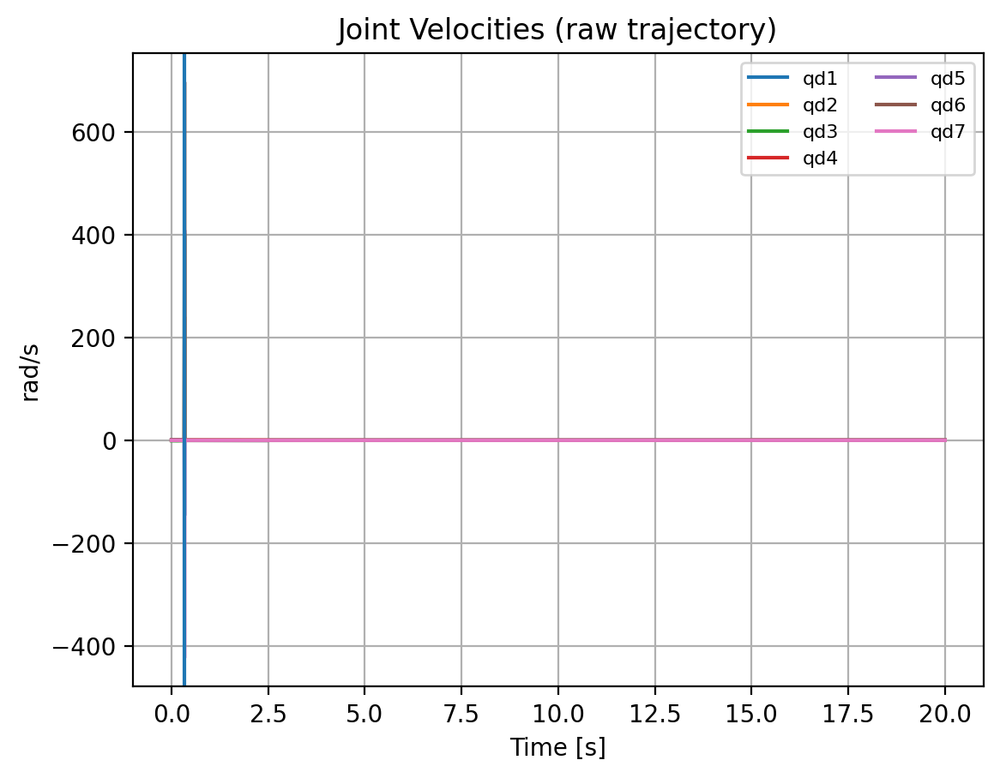
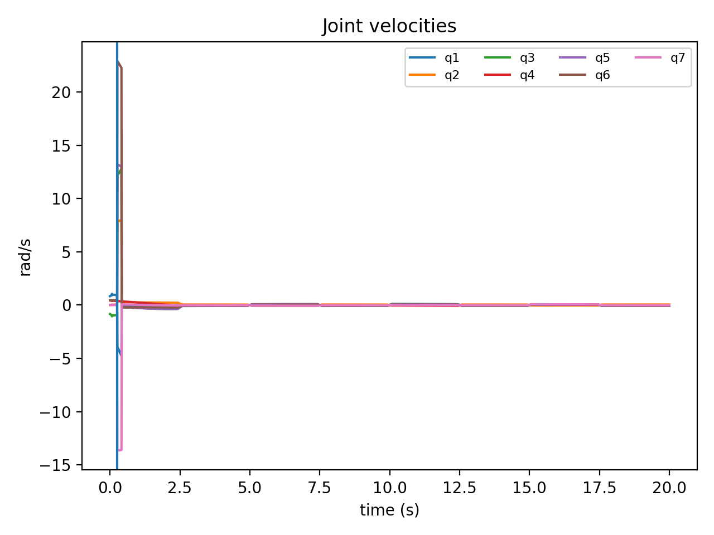

# KUKA iiwa 7-DOF Trajectory Planning

[](https://www.mathworks.com/products/matlab.html)
[](LICENSE)

Smooth joint-space trajectory generation for a **KUKA LBR iiwa 7 R800** manipulator, eliminating IK discontinuities that cause unrealistic velocity spikes.

---

## The Problem

Standard approach: Dense Cartesian interpolation + pointwise IK creates **branch jumps** — single-step discontinuities producing physically impossible joint velocities (348+ rad/s).

**This repo's solution:** Solve IK only at sparse waypoints, then generate smooth joint-space trajectories with proper time-scaling.

---

## Results

| Metric | Before | After | Improvement |
|--------|-------:|------:|:-----------:|
| Peak Joint Velocity (rad/s) | 348.56 | 22.90 | **93.4%** |
| Peak Joint Acceleration (rad/s²) | 34,877.90 | 2,249.08 | **93.6%** |

### Before: Raw Trajectory (Discontinuity at t ≈ 0.335s)


### After: Smoothed Trajectory


---

## Quick Start

### Requirements
- MATLAB R2023a+ with Robotics System Toolbox
- KUKA iiwa model via `loadrobot("kukaIiwa7")`

### Run
```matlab
% Smooth trajectory (recommended)
run('src/main_smooth_joint_traj.m')

% Original reference (shows the problem)
run('src/main_raw_cartesian_ik.m')
```

### Output
- `data/trajectory_smooth_4001x7.txt` — Controller-ready joint commands (200 Hz)
- `data/trajectory_raw_4001x7.txt` — Original problematic trajectory

---

## Technical Approach

1. **Task Definition:** Place object on 4-target marker grid with fixed end-effector orientation (Z-down, X-forward)

2. **Frame Transforms:** Base → TCP → Camera chain with solvePnP for marker localization

3. **Waypoint IK:** Solve inverse kinematics at 9 sparse waypoints (not dense interpolation)

4. **Trajectory Generation:** Cubic polynomial time-scaling for smooth 200 Hz joint trajectory

5. **Validation:** Joint angle/velocity/acceleration plots to verify physical feasibility

---

## Repository Structure

```
├── src/                    # MATLAB scripts
│   ├── main_smooth_joint_traj.m
│   └── main_raw_cartesian_ik.m
├── data/                   # Exported trajectories (Nx7)
├── assets/                 # Visualization plots
├── docs/                   # Technical report + results
└── scripts/                # Python analysis utilities
```

---

## Documentation

- [`docs/technical_report_original.pdf`](docs/technical_report_original.pdf) — Full technical report
- [`docs/results_original.pdf`](docs/results_original.pdf) — Detailed results analysis

---

## License

MIT
