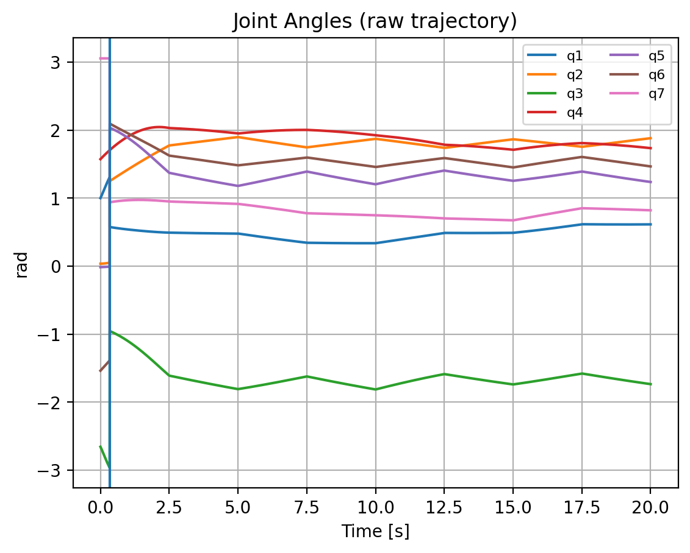
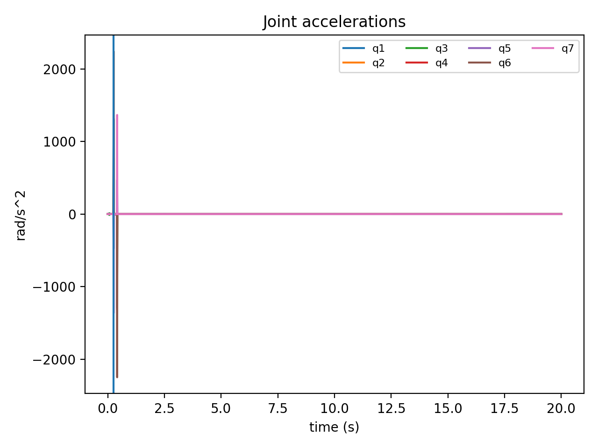

# KUKA iiwa 7DOF Manipulation: Trajectory Planning (MATLAB)

This project plans and exports a joint trajectory for a **KUKA LBR iiwa 7 R800** to place a rectangular object onto a **4-target marker grid**, while maintaining a **fixed end-effector orientation** (Z-down, X-forward).

**Why this repo exists:** the original coursework approach used dense Cartesian interpolation + pointwise IK. That can create **IK branch jumps** (a single-step discontinuity) resulting in unrealistic joint velocities. This repo keeps the original method for reference and adds a **safer, resume-ready improvement**: **solve IK only at sparse waypoints, then generate a smooth joint-space trajectory**.

## Quickstart

**Requirements**
- MATLAB + Robotics System Toolbox
- A KUKA iiwa model available via `loadrobot("kukaIiwa7")` (preferred) or a local `iiwa7.urdf`

**Run (improved smooth version)**
1. Open MATLAB at the repo root
2. Run:
   - `src/main_smooth_joint_traj.m`
3. Output trajectory:
   - `data/trajectory_smooth_4001x7.txt`

**Run (original reference version)**
- `src/main_raw_cartesian_ik.m`
- Original exported trajectory:
  - `data/trajectory_raw_4001x7.txt`

## Repo structure
- `src/` MATLAB scripts
- `data/` exported trajectories (Nx7 joint angles)
- `assets/` plots used in this README
- `docs/` original report + results PDFs
- `scripts/` optional Python analysis utilities

## Evidence: the discontinuity problem in the raw trajectory
The exported raw trajectory contains a discontinuity at **t ≈ 0.335s** (index 67), producing a peak joint speed of **348.6 rad/s** (physically unrealistic).  
The improved script is designed to eliminate that by smoothing in joint space.

## Resume-ready bullets (use after you run the smooth version and measure)
- Planned a 9-waypoint manipulation trajectory for a 7-DOF KUKA iiwa with fixed end-effector orientation; computed IK at sparse waypoints and generated a **smooth 200 Hz joint-space trajectory** (4001×7) using cubic polynomial time-scaling.
- Implemented frame-transform chain (base→TCP→camera, solvePnP marker pose) to localize a 4-target grid and execute collision-aware “safe-Z” approach moves; exported controller-ready joint commands.
- Verified motion feasibility via joint angle/velocity/acceleration plots; quantified peak joint speed and eliminated IK branch discontinuities through waypoint-based IK and smoothing.

## Original documents
See `docs/technical_report_original.pdf` and `docs/results_original.pdf`.

## License
MIT

## Results (Raw vs. smooth_post)

The exported **raw** joint trajectory contains a discontinuity early in the motion (t ≈ 0.335 s), producing unphysical kinematic peaks.
As an **interim** fix (before MATLAB waypoint-IK + time-scaling), I applied a joint-space post-processing smoother (`smooth_post`) and re-evaluated kinematics.

| Metric | Raw | smooth_post | Improvement |
|---|---:|---:|---:|
| global_max_abs_vel (rad/s) | 348.557 | 22.896 | 93.4% |
| global_max_abs_acc (rad/s²) | 34877.903 | 2249.080 | 93.6% |

**Important:** `smooth_post` is post-processing only (not a full planner). The planned MATLAB upgrade will generate a physically feasible smooth trajectory from waypoint IK + time-scaling.

### Joint velocities (smooth_post)

### Joint accelerations (smooth_post)

